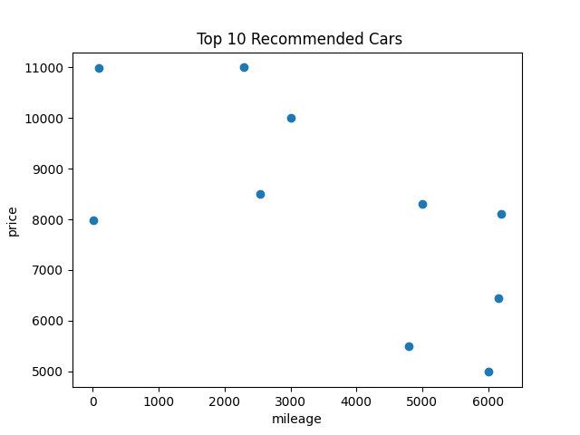

# Used Car Recommender System

This repository contains a Python script that builds a used car recommender system. The system ranks cars based on a custom score, which is calculated from the mileage, tax, price, and year of each car. 

## Dataset

The dataset used in this project is obtained from Kaggle. You can download it [here](https://www.kaggle.com/datasets/kukuroo3/used-car-price-dataset-competition-format?select=X_train.csv). The dataset includes various details about used cars such as mileage, tax, price, etc.

## Description

The Python script follows these steps:

1. **Imports necessary libraries** - The script uses pandas for data manipulation, scikit-learn for building and evaluating the machine learning model, and matplotlib for data visualization.

2. **Loads the dataset** - The dataset is loaded into a pandas DataFrame.

3. **Handles missing values** - Any missing values in the dataset are dropped.

4. **Creates a custom score** - A score for each car is calculated based on its mileage, tax, price, and year.

5. **Prepares the data for modeling** - The dataset is split into features (X) and target (y). Categorical features are one-hot encoded.

6. **Splits the data** - The dataset is divided into a training set and a test set.

7. **Trains a random forest model** - A random forest regressor is fitted on the training data.

8. **Evaluates the model** - The model's performance is evaluated on the test set using the mean squared error metric.

9. **Makes predictions** - The model predicts scores for all cars in the dataset.

10. **Sorts the cars by predicted score** - Cars are sorted in ascending order of their predicted scores.

11. **Displays the top recommended cars** - The top 10 cars with the highest predicted scores are printed.

12. **Visualizes the data** - A scatter plot of the top recommended cars, showing their mileage and price, is displayed.



## Usage

1. Clone this repository.

2. Download the dataset from the above link and place it in the same directory as the script.

3. Run the following command:

```bash
python used_car_recommender.py
```

This command will print the mean squared error of the model and display the top 10 recommended cars. It will also plot a scatter graph of the top recommended cars with their mileage and price.

## Dependencies

This script requires the following Python libraries:

    1. pandas
    2. scikit-learn
    3. matplotlib

You can install these libraries using pip:

```bash
pip install pandas scikit-learn matplotlib
```
## Author

This project is created by Taha Khan. For any queries, feel free to contact me (tahak070@gmail.com).


